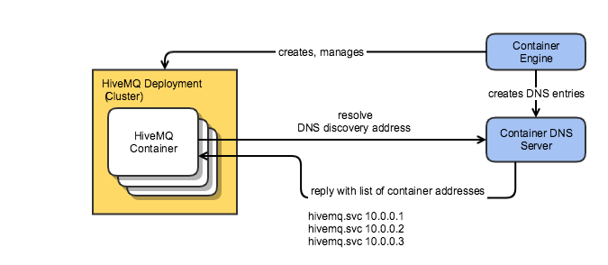

:hivemq-support: http://www.hivemq.com/support/
:round-robin: https://en.wikipedia.org/wiki/Round-robin_DNS
:docker-swarm: https://github.com/hivemq/hivemq4-docker-images#docker-swarm
:dns-discovery-image: https://github.com/hivemq/hivemq4-docker-images#dns-discovery-image
:hivemq-docker-image: https://github.com/hivemq/hivemq4-docker-images

== HiveMQ DNS Cluster discovery extension
*Extension Type*: Integration

*Version*: 4.0.0

*License*: Apache License 2.0

=== Purpose

This HiveMQ extension enables you to operate elastic HiveMQ clusters with an container orchestration platform (Kubernetes, Openshift) as well as cloud environments. DNS is used as cluster discovery mechanism, which is ideal for environments that scale dynamically. HiveMQ instances are added and removed at runtime as soon as they become available via DNS. This extension is typically used with {hivemq-docker-image}[Docker] and container orchestration platforms.

This extension can be used with any cloud environment / container orchestration environment that supports service discovery using a {round-robin}[round-robin^] DNS A record.

=== Installation
The extension must be unzipped and the complete extension folder must be placed into the extensions folder.
After this adapt the properties to your needs as described in the Configuration chapter.

=== Configuration
The following environment variables or property keys should be used to
customize the discovery parameters.

If a properties file is provided (`dnsdiscovery.properties` in `conf/`
folder), the extension will use the key-value pairs from this file and
reload the values on file changes.

The extension will attempt to load the properties file first. If it does not
exist, the extension will not attempt to reload the properties and instead
try to read from the environment variables on each iteration until
broker shutdown.

*Configuration options:*

|=======================================================================
|Environment Variable |Default value |property key |Meaning
|HIVEMQ_DNS_DISCOVERY_ADDRESS |- |discoveryAddress |Address providing the A
record for the usage as cluster node addresses
|HIVEMQ_DNS_DISCOVERY_TIMEOUT |30 |resolutionTimeout |Wait time
for DNS resolution to complete
|=======================================================================

[[sample-dns-record]]
==== Sample DNS record

The following list shows a sample round-robin A-record as expected and parsed by the
extension:

....
$ dig tasks.hivemq        

; <<>> DiG 9.10.3-P4-Debian <<>> tasks.hivemq
;; global options: +cmd
;; Got answer:
;; ->>HEADER<<- opcode: QUERY, status: NOERROR, id: 21767
;; flags: qr rd ra; QUERY: 1, ANSWER: 5, AUTHORITY: 0, ADDITIONAL: 0

;; QUESTION SECTION:
;tasks.hivemq.          IN  A

;; ANSWER SECTION:
tasks.hivemq.       600 IN  A   10.0.0.6
tasks.hivemq.       600 IN  A   10.0.0.5
tasks.hivemq.       600 IN  A   10.0.0.4
tasks.hivemq.       600 IN  A   10.0.0.7
tasks.hivemq.       600 IN  A   10.0.0.3
....

This record represents a 5 node cluster on an overlay network.

[[first-steps]]
=== First steps

This diagram shows how DNS discovery is generally implemented on container engines.

The components differ when using DNS discovery outside of container engine.
When using it in conjunction with DNSaaS solutions for example, the DNS entries will be created by the orchestration solution used instead.



The container engine provides a DNS server to the containers/pods for improved caching of DNS queries as well as additional functionality like service discovery and hostnames for the containers.

This DNS server is the main endpoint the DNS discovery extension will communicate with. The DNS server responds with a predefined record which is created by the orchestration engine.
The record contains the list of containers/pods in the cluster, which HiveMQ will then use to discover the other nodes.

[[usage]]
==== Container environment usage

Most container orchestration environments support this type of discovery. See the following list for some examples:

* https://kubernetes.io/docs/concepts/services-networking/service/#headless-services[Kubernetes^]
* https://docs.docker.com/docker-cloud/apps/service-links/#discovering-containers-on-the-same-service-or-stack[Docker Swarm^]
* https://mesosphere.github.io/mesos-dns/[Mesos^]
* https://docs.openshift.com/container-platform/3.6/architecture/core_concepts/pods_and_services.html#headless-services[Openshift^]

More information on using the discovery mechanisms listed above can be found in the {dns-discovery-image}[DNS discovery image README^]

To implement your own solution for this discovery method, you must either provide your HiveMQ deployment with

* a custom DNS record on your cloud provider's DNS service containing the addresses of your HiveMQ instances.
* an alternative DNS server included with the deployment, serving general DNS to the HiveMQ instances as well as providing a service discovery record.

===== Kubernetes

To use DNS discovery on Kubernetes, you will generally need a headless service pointing to the HiveMQ deployment, similar to the following configuration:

```
kind: Service
apiVersion: v1
metadata:
  name: hivemq-discovery
  annotations:
    service.alpha.kubernetes.io/tolerate-unready-endpoints: "true"
spec:
  selector:
    app: hivemq-cluster1
  ports:
    - protocol: TCP
      port: 1883
      targetPort: 1883
  clusterIP: None
```

NOTE: The selector and name for the service are important. The selector defines which pods are listed in the resulting DNS record.

NOTE: The name will define the `service-name` of the resulting DNS record, which will be generally in the form of `<service-name>.<kubernetes-namespace>.svc.<dns-domain>`.

==== Docker Swarm

Docker swarm provides a DNS entry for service discovery by default. All you have to do is create a service, as shown in {docker-swarm}[DNS discovery image README^].

==== Need help?

If you encounter any problems, we are happy to help. The best place to get in contact is our {hivemq-support}[support^].
